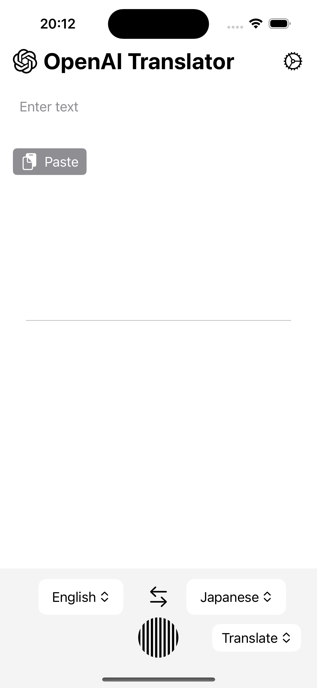
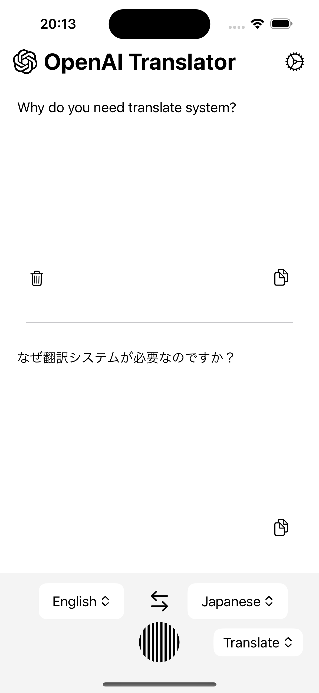
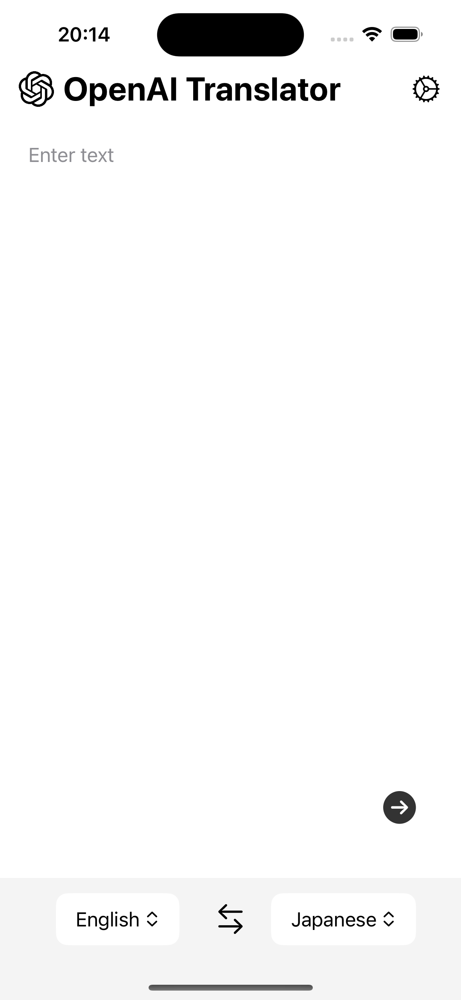
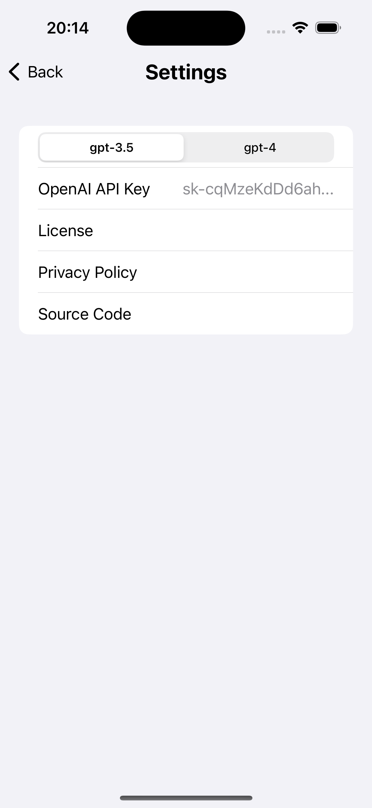
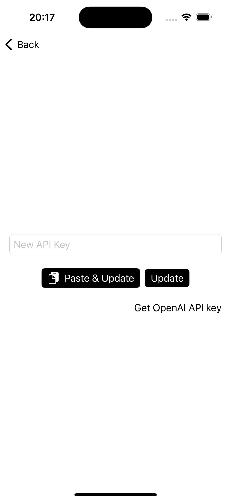

# OpenAI Translator

## Overview

### Multifunctional Language Tool Utilizing ChatGPT

Our application leverages ChatGPT to support advanced translation and summarization, going a step beyond conventional translation services to achieve language conversion that is both natural and easy to understand.

### 🌟 Key Features

- **Understandable Translations**: Support for translations with natural expressions, thanks to ChatGPT's sophisticated language comprehension.
- **Efficient Summarization**: Condense text to provide information that captures the key points concisely.

### 🔒 Prioritizing Your Privacy

Operates as a front-end application without using a back-end server, ensuring user data is processed securely on the device.
Requires user API key setup, but the application does not obtain any personal information.
This application is designed for all users who want to conveniently and securely use a language conversion tool. Harness the advanced technology of ChatGPT and expand the new possibilities in communication!

## application icon

## Screen

### Welcom View

### Translate View

### Translated View

### Translated Input View

### Setting View

### Input API Key View

